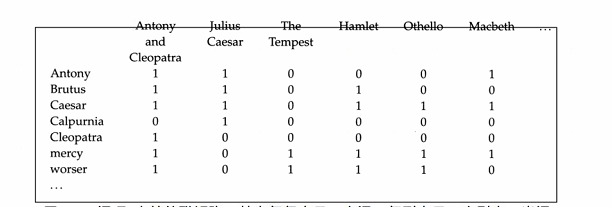

# Boolean Retrival(布尔检索) and Posting Lists(倒排索引表)
## 问题描述
***
>利用文档和词项的布尔关系建立倒排索引表,根据倒排索引表进行布尔表达式查询.这里只实现AND操作.
## 布尔检索
***
>布尔检索模型反应了文档和词项集合的关系
布尔检索模型为一个关于词项-文档关联的二维矩阵,其中每一行表示一个词(term),每列表示一个文档(document).当词t在文档d中存在时,矩阵元素(t,d)的值为1,否则为0

## 倒排索引
***
>每个词项都有一个记录出现该词项所有文档的列表,该表中的每个元素记录的时词项在某个文档中的一次出现信息(有时候还会包括词项在文档中出现的位置),这个表中的每个元素通常称为倒排记录(posting).每个词项对应的整个表称为倒排索引表(posting list).

 
* **建立过程**
1. 对每篇文档建立索引时的输入为一个归一化的词条表,也可以看成二元组(词项,文档ID)的一个列表
2. 将这个列表按照词项的字母顺序进行排序,其中一个词项在同一个文档的多次出现会合并在一起,最后整个结果分成词典和倒排记录表两个部分.
>* 由于一个词项通常会在多篇文档中出现,上述组织数据的方法实际上也已经减少了索引的存储空间.
>* 词典中同样可以记录一些统计信息,比如出现某词项的文档数目,即文档频率,这里也就是每个倒排记录表的长度,该信息对于一个基本的布尔搜索引擎来说不是必需的,但是它可以在处理查询时提高搜索效率.
>* 倒排索引表会按照docID进行排序,这对于高效查询时非常重要的基础,也是实现布尔计算的必要条件.

* **完整的倒排索引** 
 

* 数据结构 
建立map<String,Object>的数据结构保存字典。String为字典里唯一的term，一个Object对象包括频率freq(int)和对应的文档ID列表postingList(Arraylist).

* 初始化数据时可以选择建立布尔检索模型,也可以直接调用插入方法.这里我实现的是直接调用插入方法`Insert(term,documentID)`

        public void Insert(String term,int docID) {//term为单词(索引)，docID为所在文档
            if(!dir.containsKey(term)) {//如果字典里没有这个单词，则直接加入
                FreqAndId fId = new FreqAndId();//建立包含频率freq和postingList的对象
                fId.addFreq();//freq设置为1
                fId.adddocId(docID);//postingList加入docID
                dir.put(term, fId);//和term一起加入到字典中，按照升序插入
            }
            else {//如果字典里包含了这个term
                FreqAndId fId = dir.get(term);//获取这个term所对应的object信息
                if(!fId.postingList.contains(docID)) {//是否已经包含这个docID,不包含则进入
                    fId.addFreq();//freq++
                    fId.adddocId(docID);//postingList加入新的docID
                    dir.put(term, fId);//新的信息插入时为替代原来的信息(map Key值唯一)
                }
            }		
	    }

* 虽然TreeMap默认会对插入元素根据Key的值(也就是term)进行升序排序，但是索引建立过程中，或者说查找过程中会希望是忽略大小写的，所以在这里需要重写TreeMap的比较器

        dir = new TreeMap<String,FreqAndId>(new Comparator<String>(){
             public int compare(String o1, String o2) {
                 //如果有空值，直接返回0
            	 	o1 = o1.toLowerCase();//将term的值转成小写
            	 	o2 = o2.toLowerCase();
                 if (o1 == null || o2 == null)
                     return 0; 
                return String.valueOf(o1).compareTo(String.valueOf(o2));//然后进行比较
             }
		 });

## 倒排记录表(posting list)的合并
倒排记录的表的合并(AND)实现了当一个词条包含多个关键词(term)时,可以检索得到包含所有关键词的文档,也就是求倒排记录表的交集;以此类推,OR操作即求并集,可以检索包含一个或多个关键词的文档.求补集的操作则可以过滤包含某关键词的文档.

* 合并算法 `Intersection(String, String)` 
 

## 实现结果 
